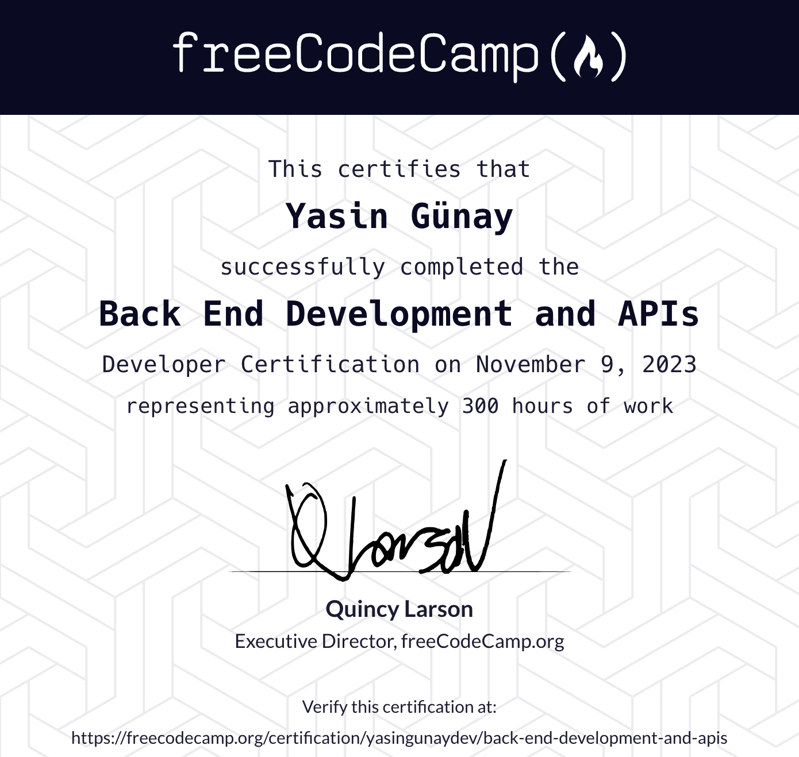

# Back-End-Development-and-APIs-Projects
https://www.freecodecamp.org/learn/back-end-development-and-apis/#back-end-development-and-apis-projects

You've worked with APIs before, but now that you know npm, Node, Express, MongoDB, and Mongoose, it's time to build your own. Draw on everything you've learned up to this point to create 5 different microservices, which are smaller applications that are limited in scope.

After creating these, you'll have 5 cool microservice APIs you can show off to friends, family, and potential employers. Oh, and you'll have a shiny new Back End Development and APIs Certification, too.

- Timestamp Microservice
  
- Request Header Parser Microservice

- URL Shortener Microservice

- Exercise Tracker

- File Metadata Microservice

